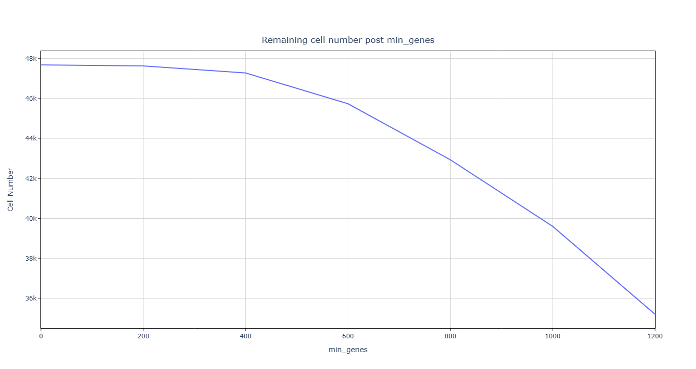
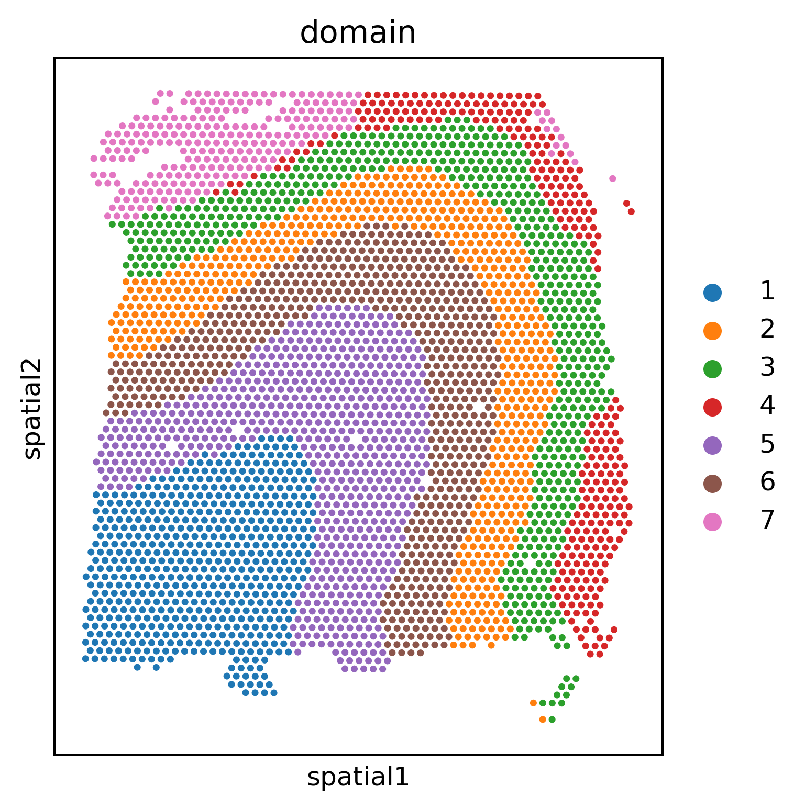

## **Prepare the input .h5ad file**
Here, we apply SpatialQC to analyze the [ST](https://db.cngb.org/stomics/datasets/STDS0000012).
The repository contains 48 Spatial Tancriptomics (ST) sections (24 of the 
hippocampus and 24 of the olfactory bulb). The sections were obtained 
from an Alzheimer´s disease mouse model: 3xAD, 3xPB, 3xPB and WT For each 
section. Download the raw data for the 6 slices of Mouse Olfactory Bulb 
(WT) dataset [here](https://db.cngb.org/stomics/datasets/STDS0000012
) for demonstration purposes.


Then get the raw .h5ad file in jupyter with the following code:
```Python
import scanpy as sc
file_paths = ['ST/OFB_wt_rep1_ST.h5ad', 'ST/OFB_wt_rep2_ST.h5ad', 'ST/OFB_wt_rep3_ST.h5ad',
              'ST/OFB_wt_rep4_ST.h5ad', 'ST/OFB_wt_rep5_ST.h5ad', 'ST/OFB_wt_rep6_ST.h5ad']
adata_list = []
for i, file_path in enumerate(file_paths, start=1):
    cdata = sc.read(file_path)
    cdata.obs['slice'] = f's{i}'
    adata_list.append(cdata)
adata = sc.concat(adata_list, join='outer')
adata.var_names_make_unique()
adata.obs = adata.obs[['slice']]
adata.write('ST.h5ad')
```

The data contained 6 slice, 1311 cells and 17979 genes. The coordinates are 
stored in anndata.obs['spatial']. Slice information is stored in anndata.obs['slice'].


## **Prepare the input marker genes .csv file**
Download the marker genes from [Tepe et al. (2018)](https://www.ncbi.nlm.nih.gov/pmc/articles/PMC6342206/#SD2).
```python
import pandas as pd
!wget https://www.ncbi.nlm.nih.gov/pmc/articles/PMC6342206/bin/NIHMS1516652-supplement-2.xls
mark=pd.read_csv('NIHMS1516652-supplement-2.xls',sep='\t')
mark.gene.to_csv('markers.csv',index=False)
```

## **Quality control**
Features of ST: (1) spot containing multiple cells; (2) high depth; 
(3)The number of spots is usually small. Hence, choose Visium platform.


Execute SpatialQC in the shell terminal:
```bash
SpatialQC --adata ST.h5ad --markers markers.csv --platform Visium --slice slice --mito 'mt-'
```
```
151507 score: 6.0
151508 score: 5.0
151509 score: 6.0
151510 score: 6.0
151669 score: 7.0
151670 score: 7.0
151671 score: 7.0
151672 score: 7.0
151673 score: 10.0
151674 score: 11.0
151675 score: 8.0
151676 score: 9.0
Number of detected doublets: 0
Automatic threshold for n_genes is: 490
Count of cells with mitochondrial gene percentage greater than 0.3: 235
The suitable threshold for n_cells is: 2
```
--platform Visium same as: --doublet False --n 0.95 --l 0.99 --s 4 --min_genes_list 0 200 400 600 800 1000 1200
--min_genes_list2 0 200 400 600 800 1000 1200 --min_cells_list 1 2 3 4 5.
Users can specify which parameter overrides they want to modify. 
Keep the default values here. 
The [html output](https://github.com/mgy520/SpatialQC/tree/main/report/Visium/report.html) can be downloaded at github.

As the terminal output shows, All slices have a median score greater than 4.


Since Visium spots contain multiple cells, the doublet setting is set to False, 
detecting 0 doublet cells. To preserve more than 95% of the available spots, 
spots with less than 490 n_genes were deleted. 


To preserve more than 99% of
the detected marker genes, genes with fewer than 2 cells were removed.

Clean data after filtering:


## **Downstream analysis with scanpy and GraphST**
```python
import scanpy as sc
from GraphST.utils import clustering
from GraphST import GraphST
adata = sc.read_h5ad('DLPFC/filtered.h5ad')
adata=adata[adata.obs.slice == '151673']
model = GraphST.GraphST(adata, device='cuda')
adata = model.train()
radius = 50
clustering(adata, 7, radius=radius, method='mclust', refinement=True)
sc.pl.spatial(adata,spot_size=100, color=["domain"], show=True)
```


```python
sc.pp.neighbors(adata, use_rep='emb_pca', n_neighbors=10)
sc.tl.umap(adata)
sc.pl.umap(adata, color='domain', title=['Predicted labels'], show=True)
```

