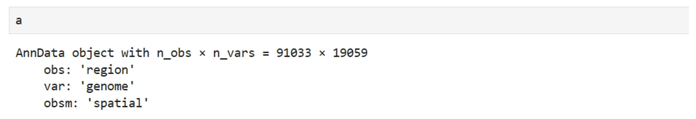
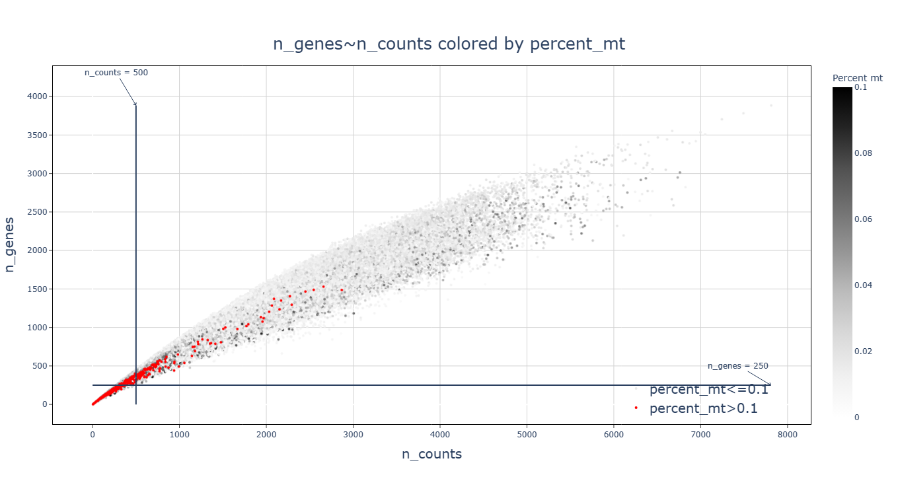
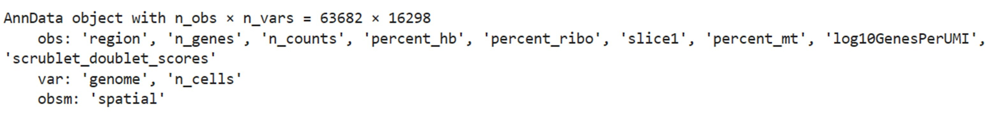
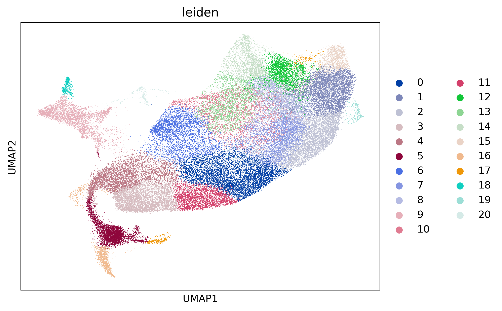
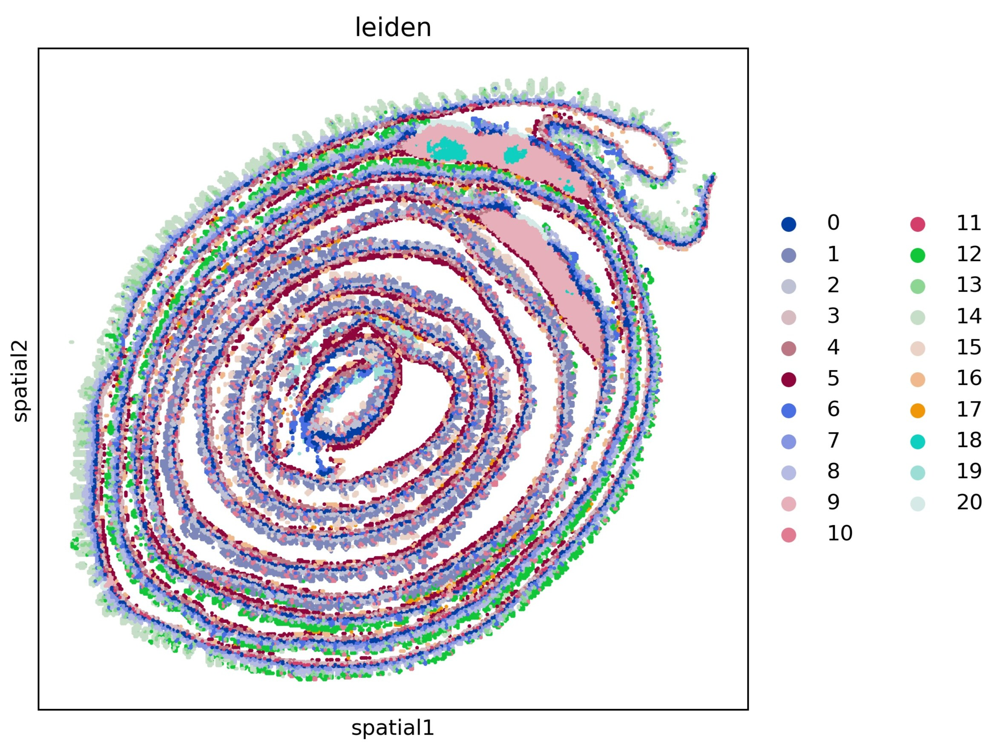
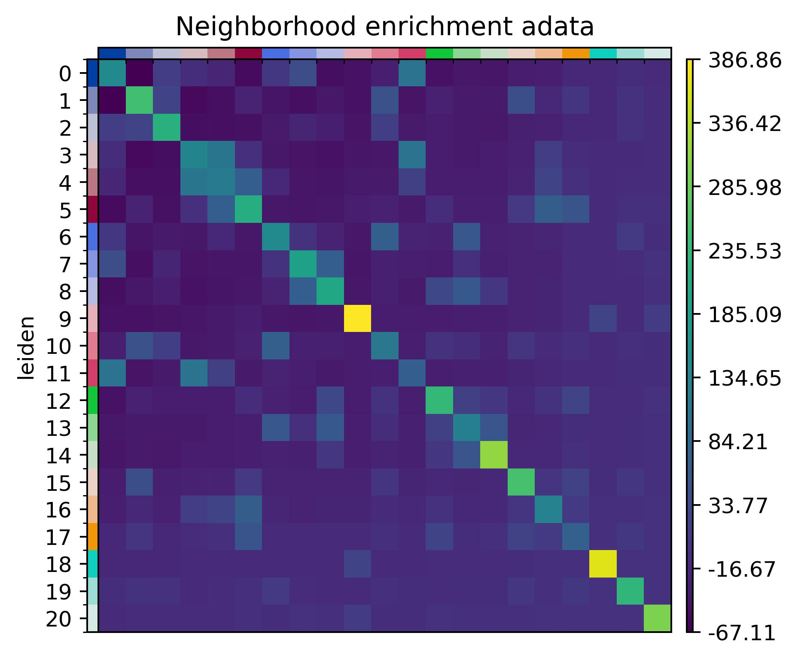

## **Prepare the input .h5ad file**
Here, we apply SpatialQC to analyze the [Visium HD data](https://s3.embl.de/spatialdata/spatialdata-sandbox/visium_hd_3.0.0_io.zip). The sample is a mouse small intestine tissue block (FFPE) from Charles River Laboratories. Sequencing was performed on an Illumina NovaSeq 6000 platform.


We can get the raw .h5ad file in jupyter with the following code:
```Python
!wget https://s3.embl.de/spatialdata/spatialdata-sandbox/visium_hd_3.0.0_io.zip
!unzip *zip
import spatialdata as sd
sdata = sd.read_zarr('data.zarr')
for table in sdata.tables.values():
    table.var_names_make_unique()
from spatialdata_io.experimental import to_legacy_anndata
a=to_legacy_anndata(sdata,table_name='square_016um',coordinate_system='downscaled_hires')
a.write('visium_hd.h5ad')
```

The data contained 1 slice, 91,033 cells and 19,059 genes. The coordinates are 
stored in anndata.obs['spatial'].




## **Quality control**
Features of Visium HD: (1) single-cell resolution; (2) Low depth. Other 
similar techniques include Stereo-seq, Seq-scope, Pixel-seq, HDST. These 
techniques essentially operate at subcellular resolution, typically requiring
cell segmentation or binning to merge multiple transcripts into one "cell".
Typically, the diameter of a single "cell" ranges from 10 to 100 μm.


Execute SpatialQC in the shell terminal:
```bash
SpatialQC --adata visium_hd.h5ad --platform Stereo-seq --slice_number 1 --mito 'mt-' --species Mouse --tissue_class Intestine --tissue_type 'Small intestine' --cancer_type Normal --l 1
```
```
slice1 score: 9.0
Number of detected doublets: 585
Automatic threshold for n_genes is: 510
Count of cells with mitochondrial gene percentage greater than 0.1: 42
The suitable threshold for n_cells is: 27
```
--platform Stereo-seq same as: --doublet True --n 0.7 --l 0.99 --s4 --min_genes_list 0 200 400 600 800 1000 1200
--min_genes_list2 0 200 400 600 800 1000 1200 --min_cells_list 0 10 20 30 40.
Users can specify which parameter overrides they want to modify. 
Here we set the threshold for --l 1, n_cells to preserve all detected genes. 
The [html output](https://github.com/mgy520/SpatialQC/tree/main/report/Visium_HD/report.html) can be downloaded at github.

As the terminal output shows, the only slice has a median score of 9.
585 doublet cells were detected and removed. To preserve more than 70% of the available cells, 
cells with less than 510 n_genes were deleted. 42 cells with a mitochondrial
gene ratio greater than 0.1 were removed. Finally, at the gene level, all
detected marker genes were retained, with a threshold of 27 for n_cells.


Clean data after filtering:



## **Downstream analysis with Scanpy and Squidpy**
```python
import scanpy as sc
adata = sc.read_h5ad('filtered.h5ad')
adata.layers["counts"] = adata.X.copy()
sc.pp.normalize_total(adata, inplace=True)
sc.pp.log1p(adata)
sc.pp.pca(adata)
sc.pp.neighbors(adata)
sc.tl.umap(adata)
sc.tl.leiden(adata)
sc.pl.umap(adata, color=["leiden"], wspace=0.4)
```


```python
import squidpy as sq
sq.pl.spatial_scatter(adata, shape=None, color=["leiden"], wspace=0.4)
```

Plot the clustering on spatial coordinates.

Neighbors enrichment analysis
```python
sq.gr.spatial_neighbors(adata, coord_type="generic", delaunay=True)
sq.gr.nhood_enrichment(adata, cluster_key="leiden")
sq.pl.nhood_enrichment(
    adata,
    cluster_key="leiden",
    title="Neighborhood enrichment adata"
)
```

