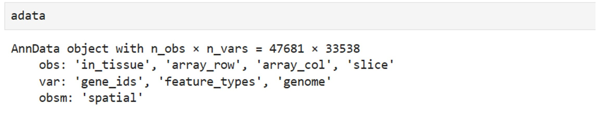
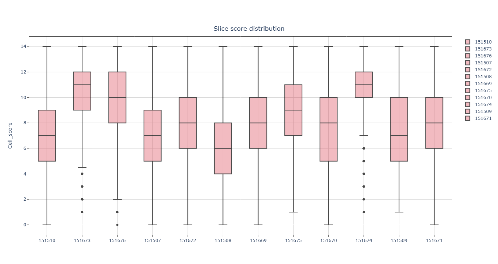
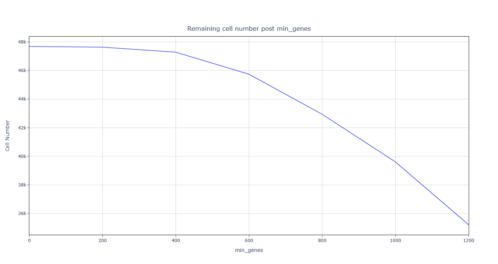
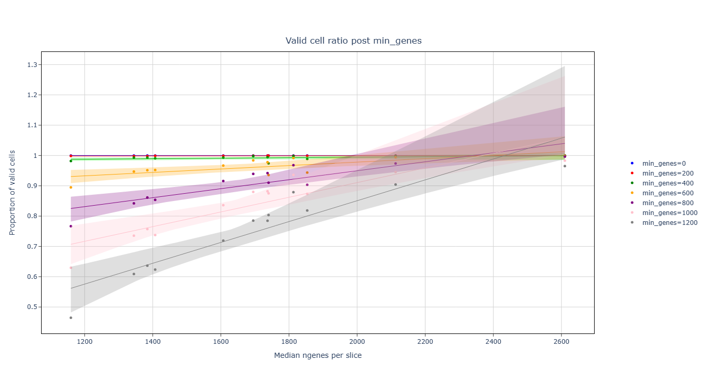
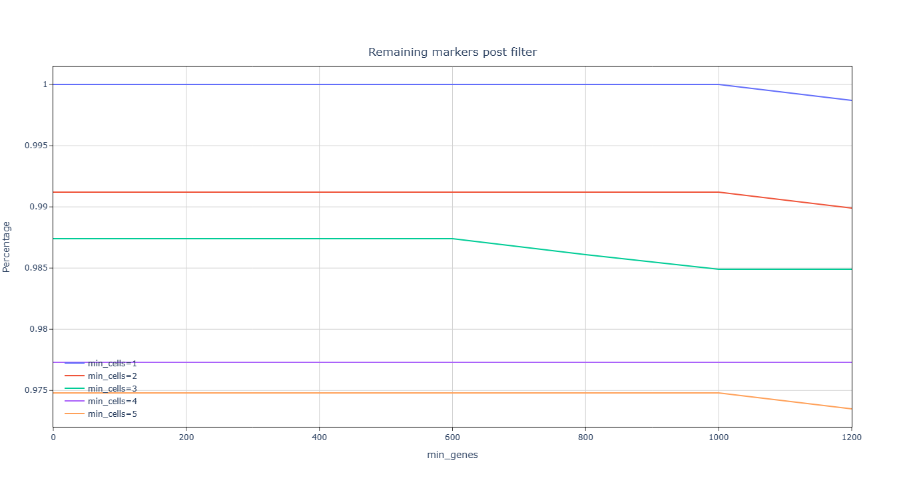
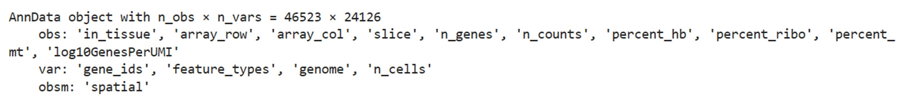
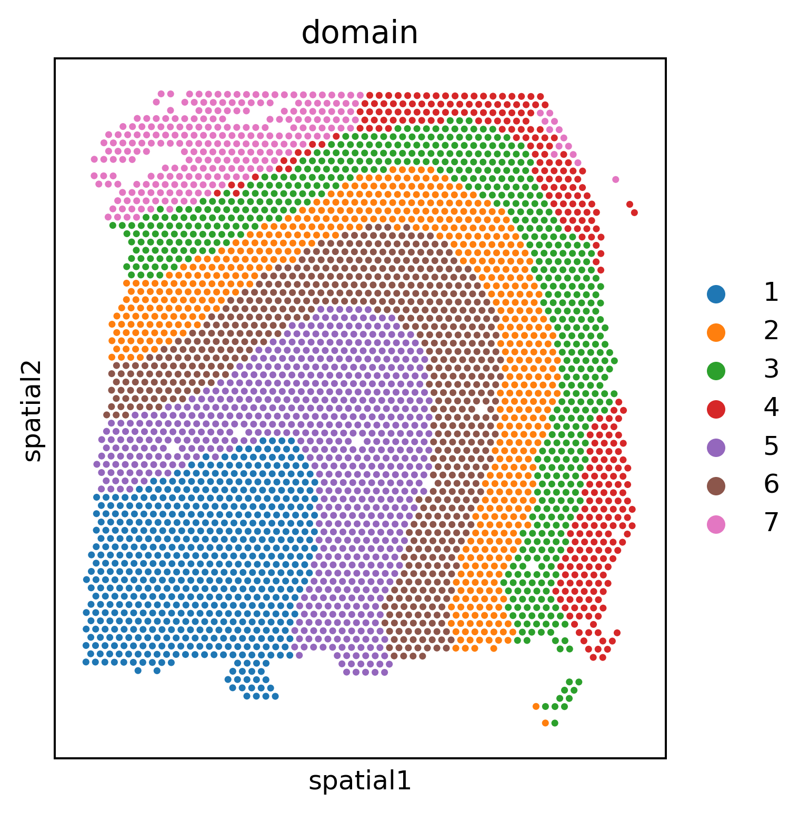
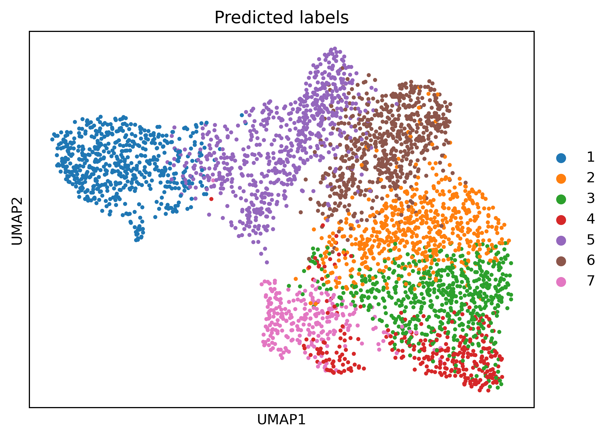

## **Prepare the input .h5ad file**
Here, we apply SpatialQC to analyze the [human postmortem DLPFC (neurotypical)](https://db.cngb.org/stomics/datasets/STDS0000005) data by 10x Visium. 
DLPFC data contains expression values of 33,538 genes measured on two pairs of tissue sections from three independent neurotypical adult donors. Each pair consisted of two directly adjacent, 10 μm
serial tissue sections with the second pair located 300 μm posterior to the first, resulting in a total of 12 tissue sections. Download the raw .h5ad files for the 12 slices [here](https://db.cngb.org/stomics/datasets/STDS0000005).

Then get the raw .h5ad file in jupyter with the following code:
```Python
import scanpy as sc
import os
current_directory = "./"
adata = None
for filename in os.listdir(current_directory):
    if filename.endswith(".h5ad"):
        slice_value = filename.split("_")[0]
        cdata = sc.read_h5ad(filename)
        cdata.obs['slice'] = slice_value
        if adata is None:
            adata = cdata
        else:
            adata = adata.concatenate(cdata, join='outer',batch_key=None)

adata.write_h5ad('dlpfc.h5ad')
```

The data contained 12 slice, 47,681 cells and 33,538 genes. The coordinates are 
stored in anndata.obs['spatial']. Slice information is stored in anndata.obs['slice'].



## **Prepare the input marker genes .csv file**
Download the top 40 marker genes for DLPFC [here](https://github.com/LieberInstitute/10xPilot_snRNAseq-human) in an Excel sheet.
```python
import pandas as pd
df = pd.read_excel('mmc6.xlsx',sheet_name='ST5b_DLPFC_top40markers')
pd.Series(df.values.flatten()).dropna().to_csv('markers.csv', index=False, header=['gene'])
```

## **Quality control**
Features of Visium: (1) spot containing multiple cells; (2) high depth; 
(3)The number of spots is usually small. Other similar techniques include ST (spatial transcriptomics), Slide-seq, and DBiT-seq.


Execute SpatialQC in the shell terminal:
```bash
SpatialQC --adata dlpfc.h5ad --markers markers.csv --platform Visium --slice slice --mito 'MT-' --ribo 'RPS,RPL' --mito_percent 0.3
```
```
151507 score: 6.0
151508 score: 5.0
151509 score: 6.0
151510 score: 6.0
151669 score: 7.0
151670 score: 7.0
151671 score: 7.0
151672 score: 7.0
151673 score: 10.0
151674 score: 11.0
151675 score: 8.0
151676 score: 9.0
Number of detected doublets: 0
Automatic threshold for n_genes is: 490
Count of cells with mitochondrial gene percentage greater than 0.3: 235
The suitable threshold for n_cells is: 2
```
--platform Visium same as: --doublet False --n 0.95 --l 0.99 --s 4 --min_genes_list 0 200 400 600 800 1000 1200
--min_genes_list2 0 200 400 600 800 1000 1200 --min_cells_list 1 2 3 4 5.
Users can specify which parameter overrides they want to modify. 
Keep the default values here. 
The [html output](https://github.com/mgy520/SpatialQC/tree/main/report/Visium/report.html) can be downloaded at github.

As the terminal output shows, All slices have a median score greater than 4.


Since Visium spots contain multiple cells, the doublet setting is set to False, 
detecting 0 doublet cells. To preserve more than 95% of the available spots, 
spots with less than 490 n_genes were deleted. 


To preserve more than 99% of
the detected marker genes, genes with fewer than 2 cells were removed.

Clean data after filtering:



## **Downstream analysis with scanpy and GraphST**
```python
import scanpy as sc
from GraphST.utils import clustering
from GraphST import GraphST
adata = sc.read_h5ad('DLPFC/filtered.h5ad')
adata=adata[adata.obs.slice == '151673']
model = GraphST.GraphST(adata, device='cuda')
adata = model.train()
radius = 50
clustering(adata, 7, radius=radius, method='mclust', refinement=True)
sc.pl.spatial(adata,spot_size=100, color=["domain"], show=True)
```


```python
sc.pp.neighbors(adata, use_rep='emb_pca', n_neighbors=10)
sc.tl.umap(adata)
sc.pl.umap(adata, color='domain', title=['Predicted labels'], show=True)
```

