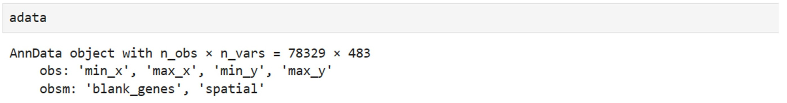
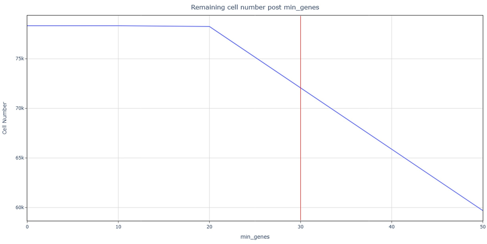
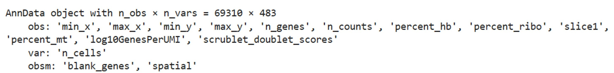
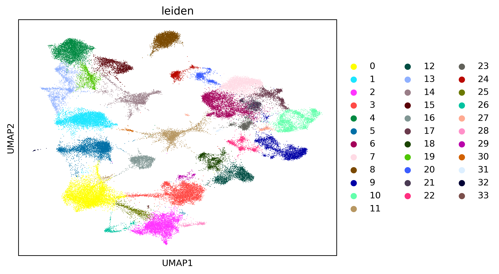
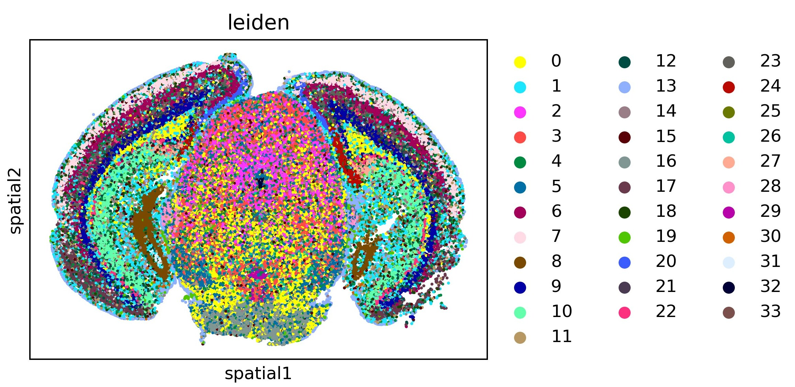
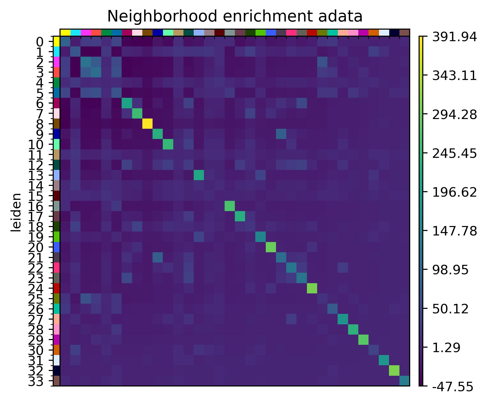

## **Prepare the input .h5ad file**
Download the data from [Vizgen MERFISH Mouse Brain Receptor Dataset](https://info.vizgen.com/mouse-brain-map?submissionGuid=a66ccb7f-87cf-4c55-83b9-5a2b6c0c12b9). 
Unpack the .tar.gz file. The dataset contains a MERFISH measurement of 
a gene panel containing 483 total genes including canonical brain cell 
type markers, GPCRs, and RTKs measured on 3 full coronal slices across 
3 biological replicates. This is one slice of replicate 1.

The data needs to be downloaded manually. Users need to sign up for Google cloud.  
Then get the raw .h5ad file in jupyter with the following code:

```Python
import squidpy as sq
adata = sq.read.vizgen(
    path='MERFISH/',
    counts_file="datasets_mouse_brain_map_BrainReceptorShowcase_Slice1_Replicate1_cell_by_gene_S1R1.csv",
    meta_file="datasets_mouse_brain_map_BrainReceptorShowcase_Slice1_Replicate1_cell_metadata_S1R1.csv",
    transformation_file="datasets_mouse_brain_map_BrainReceptorShowcase_Slice1_Replicate1_images_micron_to_mosaic_pixel_transform.csv",
)
adata.write('vizgen.h5ad')
```

The data contained 1 slice, 78,329 cells and 483 genes. The coordinates are 
stored in anndata.obs['spatial'].


## **Quality control**
Features of image-based spatial transcriptome technology: (1) single-cell 
resolution; (2) Low depth; (3) Genes are marker genes of prior design.  

Execute SpatialQC in the shell terminal:
```bash
SpatialQC --adata vizgen.h5ad --platform MERFISH --slice_number 1
```
```
slice1 score: 4.0  
Number of detected doublets: 6679  
Automatic threshold for n_genes is: 30  
Count of cells with mitochondrial gene percentage greater than 0.1: 0  
Using user-provided min_cells: 1  
```

--platform MERFISH same as: --doublet True --n 0.9 --min_cells 1 --s 3 
--min_genes_list 0 10 20 30 40 50 --min_genes_list2 0 10 20 30 40 50 
--min_cells_list 1 --s2 0 0 1.
Users can specify which parameter overrides they want to modify. 
Keep the default values here. 
The [html output](https://github.com/mgy520/SpatialQC/tree/main/report/MERFISH/report.html) can be downloaded at github.

As the terminal output shows, the only slice has a score of 4; 6679 doublet cells
were detected and removed. To preserve more than 90% of the available cells, 
cells with less than 30 n_genes were deleted. All marker genes from the MERFISH data are retained.


Clean data after filtering:


## **Downstream analysis with scanpy and squidpy**
Visualize the Leiden clustering with cells divided into 34 clusters.
```Python
import scanpy as sc
adata = sc.read_h5ad('filtered.h5ad')
adata.layers["counts"] = adata.X.copy()
sc.pp.highly_variable_genes(adata, flavor="seurat_v3", n_top_genes=4000)
sc.pp.normalize_total(adata, inplace=True)
sc.pp.log1p(adata)
sc.pp.pca(adata)
sc.pp.neighbors(adata)
sc.tl.umap(adata)
sc.tl.leiden(adata)
sc.pl.umap(adata, color=["leiden"], wspace=0.4)
```



```python
import squidpy as sq
sq.pl.spatial_scatter(adata, shape=None, color=["leiden"], wspace=0.4)
```

Plot the clustering on spatial coordinates. Most clusters exhibit highly 
specific spatial patterns. Users can annotate cell types using differential
gene expression or label transfer.

Neighbors enrichment analysis
```python
sq.gr.spatial_neighbors(adata, coord_type="generic", delaunay=True)
sq.gr.nhood_enrichment(adata, cluster_key="leiden")
sq.pl.nhood_enrichment(
    adata,
    cluster_key="leiden",
    title="Neighborhood enrichment adata",
)
```


