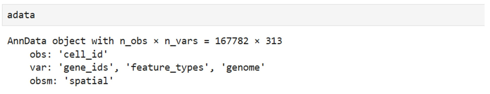
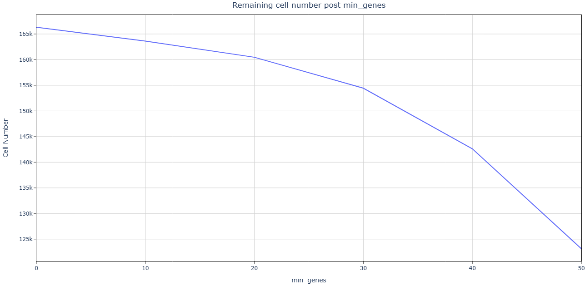
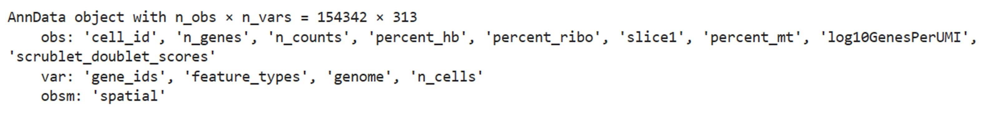
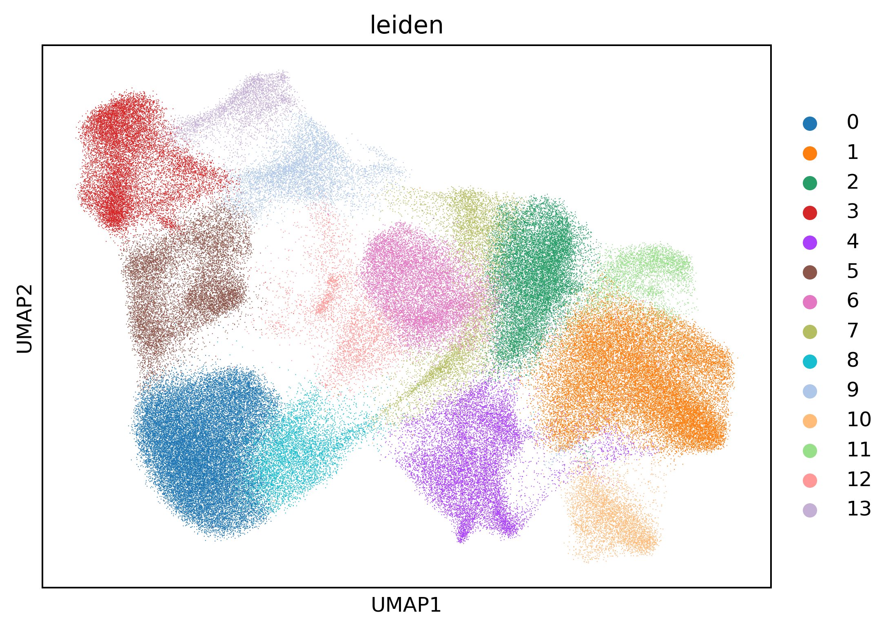
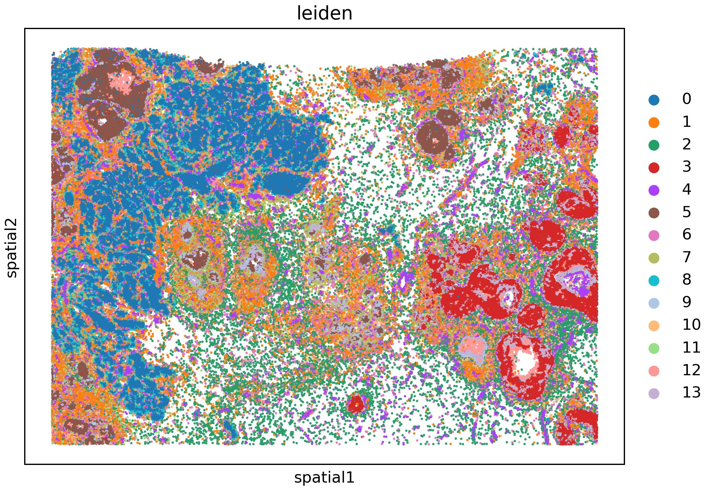
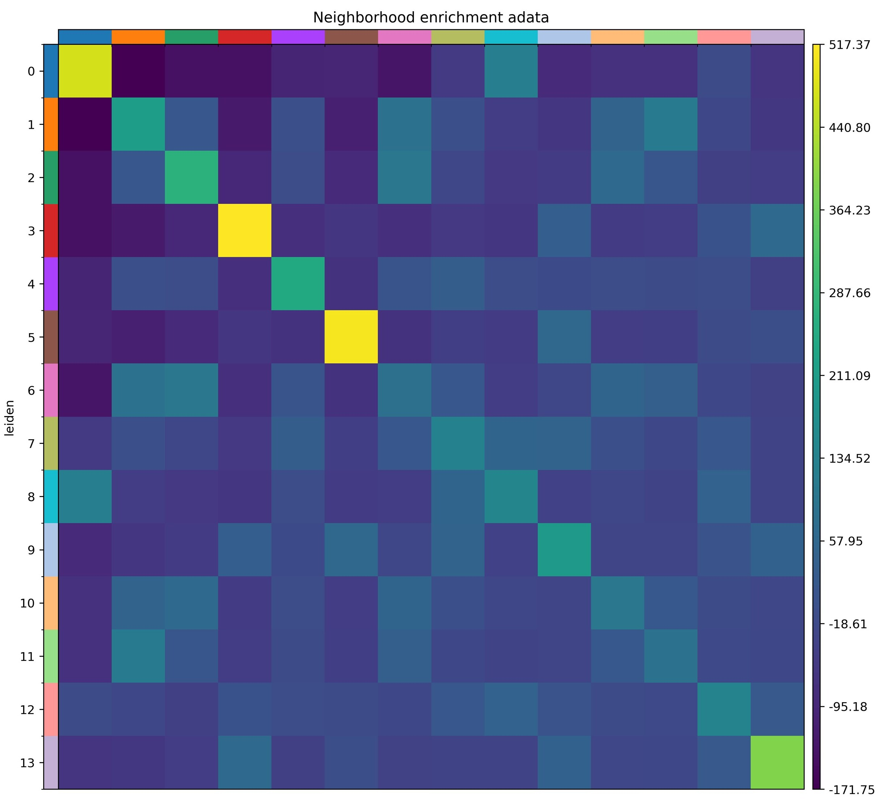

## **Prepare the input .h5ad file**
Download the Feature-cell Matrix (HDF5) and the Cell summary file (CSV) from
the Xenium [breast cancer tumor microenvironment Dataset](https://www.10xgenomics.com/products/xenium-in-situ/preview-dataset-human-breast).

Then get the raw .h5ad file in jupyter with the following code:

```Python
import scanpy as sc
import pandas as pd
!mkdir tutorial_data
!mkdir tutorial_data/xenium_data
!wget -P tutorial_data/xenium_data/ https://cf.10xgenomics.com/samples/xenium/preview/Xenium_FFPE_Human_Breast_Cancer_Rep1/Xenium_FFPE_Human_Breast_Cancer_Rep1_cell_feature_matrix.h5
!wget -P tutorial_data/xenium_data/ https://cf.10xgenomics.com/samples/xenium/preview/Xenium_FFPE_Human_Breast_Cancer_Rep1/Xenium_FFPE_Human_Breast_Cancer_Rep1_cells.csv.gz
!tar -xzf tutorial_data/xenium_data/Xenium_FFPE_Human_Breast_Cancer_Rep1_cells.csv.gz -C tutorial_data/xenium_data/

adata = sc.read_10x_h5(
    filename="tutorial_data/xenium_data/Xenium_FFPE_Human_Breast_Cancer_Rep1_cell_feature_matrix.h5"
)
df = pd.read_csv(
    "tutorial_data/xenium_data/Xenium_FFPE_Human_Breast_Cancer_Rep1_cells.csv"
)
df.set_index(adata.obs_names, inplace=True)
adata.obs = df.copy()
adata.obsm["spatial"] = adata.obs[["x_centroid", "y_centroid"]].copy().to_numpy()
adata.write('xenium.h5ad')
```

The data contained 1 slice, 167782 cells and 313 genes. The coordinates are 
stored in anndata.obs['spatial'].


## **Quality control**
Features of image-based spatial transcriptome technology: (1) single-cell 
resolution; (2) Low depth; (3) Genes are marker genes of prior design.  

Execute SpatialQC in the shell terminal:
```bash
SpatialQC --adata xenium.h5ad --platform MERFISH --slice_number 1
```
```
slice1 score: 5.0  
Number of detected doublets: 109  
Automatic threshold for n_genes is: 30  
Count of cells with mitochondrial gene percentage greater than 0.1: 0  
Using user-provided min_cells: 1  
```

--platform MERFISH same as: --doublet True --n 0.9 --min_cells 1 --s 3 
--min_genes_list 0 10 20 30 40 50 --min_genes_list2 0 10 20 30 40 50 
--min_cells_list 1 --s2 0 0 1.
Users can specify which parameter overrides they want to modify. 
Keep the default values here. 
The [html output](https://github.com/mgy520/SpatialQC/tree/main/report/xenium/report.html) can be downloaded at github.

As the terminal output shows, the only slice has a score of 5; 109 double cells
were detected and removed. To preserve more than 90% of the available cells, 
cells with less than 30 n_genes were deleted. All marker genes from the Xenium data are retained.


Clean data after filtering:


## **Downstream analysis with scanpy and squidpy**
Visualize the Leiden clustering with cells divided into 14 clusters.
```Python
import scanpy as sc
adata = sc.read_h5ad('filtered.h5ad')
adata.layers["counts"] = adata.X.copy()
sc.pp.normalize_total(adata, inplace=True)
sc.pp.log1p(adata)
sc.pp.pca(adata)
sc.pp.neighbors(adata)
sc.tl.umap(adata)
sc.tl.leiden(adata)
sc.pl.umap(adata, color=["leiden"], wspace=0.4)
```


```python
import squidpy as sq
sq.pl.spatial_scatter(adata, library_id="spatial", shape=None, color=["leiden"], wspace=0.4)
```

Plot the clustering on spatial coordinates.

Neighbors enrichment analysis
```python
sq.gr.spatial_neighbors(adata, coord_type="generic", delaunay=True)
sq.gr.nhood_enrichment(adata, cluster_key="leiden")
sq.pl.nhood_enrichment(adata, cluster_key="leiden", title="Neighborhood enrichment adata")
```


